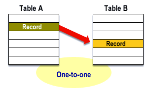
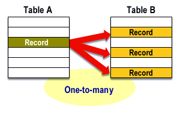

# Schemas and relationships
- What is a schema and why/when would you need one?
- What are primary keys and why do we need them?
- Create a visual representation of a mock schema for a database about GSG code Academy, using as many different kinds of relationship as you can. Explain the logic behind it.

## Database Schema 🗂️
Database schema is the description of database, specifies how data is arranged in a relational database, including logical constraints such as table names, fields, data types, and the relationships between these entities.

### Why we need database schema 🤓
- Structured data: A database schema allows you to structure your data in a logical and organized manner. This makes it easier to retrieve, manipulate, and analyze data within the database.

- Data consistency and accuracy: By defining the data types and constraints within the schema, you can ensure that the data stored in the database is consistent and accurate. This reduces the risk of errors and inconsistencies in the data.

- Data integrity: The schema can define relationships between tables and enforce constraints on the data. This ensures that the data in the database is reliable and consistent.

### When we need database schema 🤔
A database schema is used when you are designing or developing a relational database. It's an essential component of the database development process because it defines the structure, organization, and relationships of the data within the database.

## Database Relationships 🔗

Relationships are meaningful associations between tables that contain related information, they’re what make databases useful.

### Types of Relationships

- One-to-one

  

- One-to-many

  